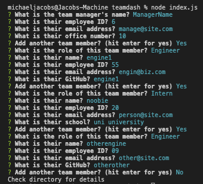
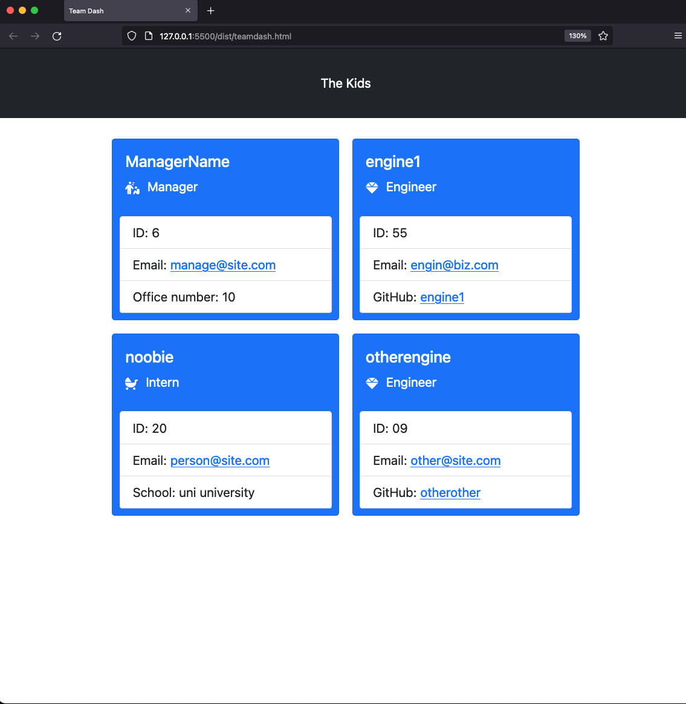

 <h1 id="project-title">teamdash</h1>
 
<!--  -->

<h2 id="table-contents">Table of Contents</h2>

-[Description](#project-desc)

-[See it Live](#project-tech)

-[Screen Captures](#project-captures)

-[Technology](#project-tech)

-[Installation](#project-inst)

-[Usage](#project-usage)

-[References](#project-ref)

-[Questions/Contact](#project-contact)

<h2 id="project-desc">Description</h2>
    This repository contains a script that will automate the creation of a development team dashboard based on a handful of employee attributes provided by the user.  

<a href="#project-title">Back to Top</a>

<h2 id="project-live">See it in action!</h2>

[Screen Recording of Application](https://drive.google.com/file/d/18wAx0UgcbuxG6OFjd28aNkIiRd1dyEPX/view?usp=sharing)

*Note: Output files will be written to the ./dist directory.*

<h2 id="project-captures">Screen captures</h2>

| Image | Description |
| --- | ----------- |
|  | Console Usage |
|    | Rendered Web Page |

<h2 id="project-tech">Technology</h2>

- Node.js
- Inquirer.js
- Jest.js
- Bootstrap
- Font Awesome

<a href="#project-title">Back to Top</a>

<h2 id="project-inst">Installation</h2>

To install Inquirer.js, run the following command in your local directory

    `npm i inquirer`

<a href="#project-title">Back to Top</a>

<h2 id="project-usage">Usage</h2>
Recommended prerequisites include node.js version 16.2.0 or later. To execute the program run the following command in your local directory

    `node index.js`

<a href="#project-title">Back to Top</a>

<h2 id="project-ref">References</h2>

- [Inquirer.js](https://www.npmjs.com/package/inquirer)
- [Jest.js](https://jestjs.io/docs/api)

<a href="#project-title">Back to Top</a>

<h2 id="project-contact">Questions / Contact</h2>

- [See more of my work on GitHub](https://github.com/mcjbyday) 

<a href="#project-title">Back to Top</a>

